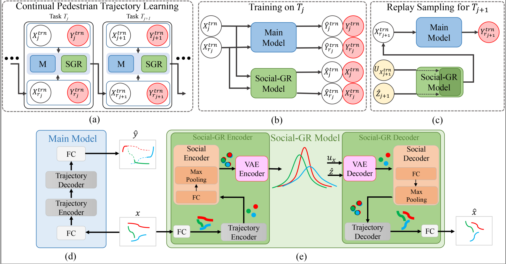

# Continual Pedestrian Trajectory Learning with Social Generative Replay
This is a repository about the continual learning for pedestrian trajectory prediction

Learning to predict the trajectories of pedestrians is particularly important for safe and effective autonomous
driving and becomes more challenging when the vehicle needs to drive through multiple environments in which the
motion patterns of pedestrians are fundamentally different between environments. Existing pedestrian trajectory
prediction models heavily rely on the availability of representative data samples during training.
In the presence of additional training data from a new environment, these models need to be retrained on
all data sets to avoid catastrophic forgetting the knowledge obtained from the already supported environments.




```markdown
    |-- data
        |-- loader.py
    |-- datasets
    |-- generative_model
        |-- vae_models.py
    |-- main_model
        |-- encoder.py
    |-- main.py
    |-- train.py
    |-- readme.md
    |-- requirements.txt
```


# Requirements

The current version of the code has been tested with

- `python 3.6.13`
- `torch 1.7.1`
- `torchvision 0.8.2`

You can run `conda install --yes --file requirements.txt` to install all dependencies.

# Running the experiments
First, we use `--main_model=lstm` as an example to illustrate.
For the `STGAT`, we only need to change the `main_model`.

## Datasets
In our benchmark, the datasets include only pedestrians.
Therefore, for both inD and INTERACTION datasets we select only pedestrian data.
In addition, for INTERACTION we also re-labeled the pedestrians.
So you need to download our processed dataset before running the code, which is in the **{dataset}** file.

## Run Individual Learning (IL)

- You can run `python main.py --method=batch_learning --log_dir=ETH --dataset_name=ETH`, the best model will be saved after the training is completed,
- Then you can run  `python evaluate_batch_learning.py --log_dir=ETH --dataset_name_train=ETH --dataset_name_test=ETH` to get the results.
- If you want to change dataset, you can change the `dataset_name`.

## Run CL-NR, CL-ER, CL-CGR and CL-SGR

Individual experiments can be run with `main.py` and use the default in code, and all results will be saved to `./results`.


- You can run `python main.py --replay=none` for _CL-NR_.

- You can run `python main.py --replay=exemplars` for _CL-ER_, in addition, you can change the percentage in `./helper/memory_eth.py`, `./helper/memory_eth_ucy.py`, `./helper/memory_eth_ucy_ind.py`

- You can run `python main.py --replay=generative --replay_model=condition` for _CL-CGR_

- You can run `python main.py --replay=generative` for _CL-SGR_


## Run ablation experiments

- You can run `python main.py --replay=generative` for _CL_SGR_STR_, you need to go to the `./ablation/CL-SGR-STR` folder.
- You can run `python main.py --replay=generative` for _CL_SGR_CPD_, you need to go to the `./ablation/CL-SGR-CPD` folder.
- You can run `python main.py --replay=generative` for _CL_SGR_RIN_, you need to go to the `./ablation/CL-SGR-RIN` folder.

## Run different task orders

- First, you need to change the task order in `main.py` line 177, 178, 179, then you can run `python main.py --replay=none` and `python main.py --replay=generative` to get the results of Table 3.

Our default task order is `ETH -> UCY -> inD -> INTERACTION`.

## Details

If you want to try another parameter.
Main options are:

- `--replay`: whether use generative replay model? (`none | generative`)
- `--replay_model`: the generative replay model (`lstm | condition`)
- `--main_model`: determine which main model to choose. (`lstm | gat`, default is `lstm`)
- `--iters`: the number of epochs. (default is `400`)
- `--z_dim`: the dimension of hidden vary z in VAE. (default is `200`)
- `--batch_size`: the mini batch size of current dataset. (default is `64`)
- `--replay_batch_size`: the mini batch size of previous dataset. (default is `64`)
- `--lr`: the learning rate. (default is `0.001`)
- `--pdf`: whether save the results to a pdf.
- `--visdom`: on-the-fly plots during training.
- `--val`: whether use the val dataset to select model, default=True.
- `--val_class`: use the val dataset of current task to validation model.

The above parameters are applicable to both GR and SGR.
For example, you can run `python main.py --replay=none --main_model=lstm --iters=400 --z_dim=200 --batch_size=64 --replay_batch_size=64 --lr=0.001 --lr_gen=0.001 --val --val_class=current --pdf --visdom`, this code will work.

## Contact
If you have any problems, you can contact <a href="mailto:wuya@gmail.com">wuya@gmail.com</a> or <a href="mailto:a.bighashdel@tue.nl">a.bighashdel@tue.nl</a>

## Reference
Our codes borrow some ideas from  <a href="https://github.com/GMvandeVen/continual-learning">continual-learning</a>, thanks for their work.
- van de Ven, Gido M., Hava T. Siegelmann, and Andreas S. Tolias. "Brain-inspired replay for continual learning with artificial neural networks." Nature communications 11.1 (2020): 1-14.